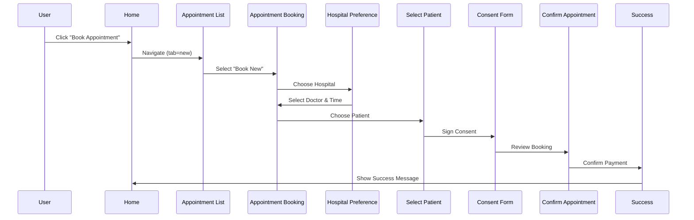

# MedicsCare App - Visual Route Map
**Quick Reference Guide**

---

## 🎯 Complete App Flow Diagram

```mermaid
graph TB
    START([App Launch]) --> SIGNIN[Sign In]
    SIGNIN --> SIGNUP[Sign Up]
    SIGNUP --> OTP[Token Verification]
    OTP --> CONFIRM[Sign Up Confirmation]
    SIGNIN --> HOME[🏠 Home Dashboard]
    CONFIRM --> HOME

    HOME --> APT_MODULE[📅 Appointments Module]
    HOME --> EMR_MODULE[📋 Medical Records]
    HOME --> RX_MODULE[💊 Prescriptions]
    HOME --> BILL_MODULE[💳 Bills]
    HOME --> FAMILY_MODULE[👨‍👩‍👧‍👦 Family]
    HOME --> PROFILE_MODULE[👤 Profile]
    HOME --> ATTACH_MODULE[📎 Attachments]
    HOME --> SERVICE_MODULE[🎧 Customer Service]
    HOME --> ADMIN_MODULE[⚙️ Admin]

    APT_MODULE --> APT1[appointment-list]
    APT_MODULE --> APT2[appointment-booking]
    APT_MODULE --> APT3[appointment-details]
    APT_MODULE --> APT4[confirm-appointment]
    APT_MODULE --> APT5[appointment-confirmed]

    EMR_MODULE --> EMR1[medical-record]
    EMR_MODULE --> EMR2[emr-visit-summary]
    EMR_MODULE --> EMR3[emr-visit-details]

    RX_MODULE --> RX1[prescription-visits]
    RX_MODULE --> RX2[prescription-visit-detail]

    BILL_MODULE --> BILL1[bills]
    BILL_MODULE --> BILL2[bill-details]

    FAMILY_MODULE --> FAM1[family-member-list]
    FAMILY_MODULE --> FAM2[family-member-form]

    PROFILE_MODULE --> PROF1[profile]
    PROFILE_MODULE --> PROF2[profile-edit]

    ATTACH_MODULE --> ATT1[attachment-list]
    ATTACH_MODULE --> ATT2[family-member-attachment-list]

    SERVICE_MODULE --> SVC1[service-requests]
    SERVICE_MODULE --> SVC2[new-service-request]

    ADMIN_MODULE --> ADM1[audit-trail]
    ADMIN_MODULE --> ADM2[hospital-list]
    ADMIN_MODULE --> ADM3[facility-information]

    style HOME fill:#4CAF50,color:#fff
    style APT_MODULE fill:#2196F3,color:#fff
    style EMR_MODULE fill:#9C27B0,color:#fff
    style RX_MODULE fill:#FF9800,color:#fff
    style BILL_MODULE fill:#F44336,color:#fff
    style FAMILY_MODULE fill:#00BCD4,color:#fff
    style PROFILE_MODULE fill:#795548,color:#fff
    style ATTACH_MODULE fill:#607D8B,color:#fff
    style SERVICE_MODULE fill:#8BC34A,color:#fff
    style ADMIN_MODULE fill:#FF5722,color:#fff
```



---

## 📱 Home Dashboard Layout

```
┌─────────────────────────────────────────┐
│  Hi, John 👋                         ≡  │  ← Header
├─────────────────────────────────────────┤
│  [Advertisement Carousel]                │
├─────────────────────────────────────────┤
│  📅 Upcoming Appointment                 │
│  Today at 10:00 AM - Dr. Smith          │
│  [View]                                  │
├─────────────────────────────────────────┤
│  Quick Actions                           │
│  ┌──────────────────────────┐           │
│  │ [+] Book Appointment     │           │
│  └──────────────────────────┘           │
│                                          │
│  ┌──────┐ ┌──────┐ ┌──────┐ ┌──────┐   │
│  │ 📅   │ │ 📋   │ │ 💊   │ │ 💳   │   │
│  │Appts │ │ EMR  │ │ Rx   │ │Bills │   │
│  └──────┘ └──────┘ └──────┘ └──────┘   │
├─────────────────────────────────────────┤
│  [🏠 Home] [📅 Appts] [👤 Profile]     │  ← Footer Nav
└─────────────────────────────────────────┘
```

---

## 🔄 User Journey: Book Appointment



---

## 🗂️ Route Categories

### ✅ Authentication (3 routes)
```
/sign-in
/sign-up
/token-verification
```

### 🏠 Home & Dashboard (1 route)
```
/home
```

### 📅 Appointments (10 routes)
```
/home/appointment-list
/home/appointment-booking
/home/hospital-preference
/home/select-patient
/home/consent-form
/home/confirm-appointment
/home/appointment-confirmed
/home/appointment-details
/chat/:sessionId
```

### 📋 Medical Records - EMR (4 routes)
```
/home/medical-record          (main list)
/home/emr-visit-summary
/home/emr-visit-details
/home/medical-attachment
```

### 💊 Prescriptions (3 routes)
```
/home/prescription-visits
/home/prescription-visit-detail
```

### 💳 Bills & Payments (2 routes)
```
/home/bills
/home/bill-details
```

### 👨‍👩‍👧‍👦 Family Management (3 routes)
```
/home/family-member-list
/home/family-member-form
/home/profiles               (alternate view)
```

### 👤 Profile & Settings (2 routes)
```
/home/profile
/home/profile-edit
```

### 📎 Attachments (3 routes)
```
/home/attachment-list
/home/family-member-attachment-list
/home/report-attachment-list
```

### 🎧 Customer Service (2 routes)
```
/home/service-requests
/home/new-service-request
```

### ⚙️ Admin Features (6 routes)
```
/home/audit-trail
/home/hospital-list
/home/modify-hospital
/home/facility-information
/home/facility-information-template
/home/edit-facility-information
```

### 💬 Chat & Communication (2 routes)
```
/chat/:sessionId
/home/chat-history
```

### 🤖 AI Assessment (1 route)
```
/patient-assessment
```

---

## ⚠️ Unused/Legacy Pages

### Not in Routing
```
✗ appointment-reschedule.page    (functionality moved to appointment-list)
✗ appointment-modification.page  (functionality moved to appointment-list)
✗ user-information.page          (possibly used as modal in audit-trail)
```

### Legacy Routes (Replaced but still defined)
```
⚠️ /home/emr           → Use /home/medical-record instead
⚠️ /home/prescription  → Use /home/prescription-visits instead
```

---

## 🎭 Modal Components (Not Routed)

These appear as overlays, not navigation:
```
family-member-selector       (Global selection modal)
add-request-popup           (Quick add service request)
rename-attachment           (Rename document)
confirmation-popup          (Confirm actions)
pdf-viewer-modal            (View PDF documents)
```

---

## 🚀 Quick Access Paths

### From Home Dashboard:

| Feature | Clicks | Path |
|---------|--------|------|
| Book Appointment | 1 | Home → "Book Appointment" → appointment-list |
| View Medical Records | 1-2 | Home → "Medical Records" (+ family selector) → medical-record |
| View Prescriptions | 1-2 | Home → "Prescriptions" (+ family selector) → prescription-visits |
| Pay Bills | 1 | Home → "Bills" → bills |
| Edit Profile | 2 | Home → Profile Icon → profile |

### Most Common User Flows:

1. **Book Appointment**: Home → Appointment List → Booking (6 steps)
2. **View Past Visit**: Home → Medical Records → Visit Summary
3. **Pay Bill**: Home → Bills → Bill Details → Pay
4. **Add Family Member**: Home → Family Selector → Add Member
5. **View Prescription**: Home → Prescriptions → Visit Detail

---

## 📊 Route Complexity

| Module | Routes | Depth | Complexity |
|--------|--------|-------|------------|
| Authentication | 3 | 1 | Low |
| Appointments | 10 | 3 | High |
| Medical Records | 4 | 2 | Medium |
| Prescriptions | 3 | 2 | Low |
| Bills | 2 | 2 | Low |
| Family | 3 | 2 | Low |
| Profile | 2 | 2 | Low |
| Attachments | 3 | 2 | Low |
| Customer Service | 2 | 2 | Low |
| Admin | 6 | 2 | Medium |

---

## 🔐 Access Control

### Public (No Login)
- Sign In
- Sign Up
- Token Verification

### Authenticated Users (All)
- Home & Dashboard
- Appointments
- Medical Records
- Prescriptions
- Bills
- Family Management
- Profile
- Attachments
- Customer Service

### Admin Only
- Audit Trail
- Hospital Management
- Facility Management

---

## 💡 Tips for Navigation

1. **Back Button**: Handled globally, works everywhere
2. **Family Selection**: Affects appointments, EMR, prescriptions
3. **Deep Links**: Support hospital code in sign-in
4. **State Passing**: Data passed via NavigationExtras
5. **Guards**: Auto-redirect to sign-in if not authenticated

---

## 📝 Testing Priority

### Critical (Must Work)
- ✅ Sign In / Sign Up flow
- ✅ Home dashboard
- ✅ Book appointment (complete flow)
- ✅ View medical records
- ✅ View prescriptions
- ✅ Pay bills

### Important (Should Work)
- ⚠️ Family member selection & switching
- ⚠️ Profile edit
- ⚠️ Upload attachments
- ⚠️ Customer service requests

### Nice to Have (Can Have Issues)
- ℹ️ Chat history
- ℹ️ Admin features
- ℹ️ AI Assessment

---

**Total Active Routes**: 36
**Total Pages**: 51
**Modal Components**: 6
**Unused Pages**: 3-5

---

For detailed information, see: [Complete Route Map](./route-map.md)
