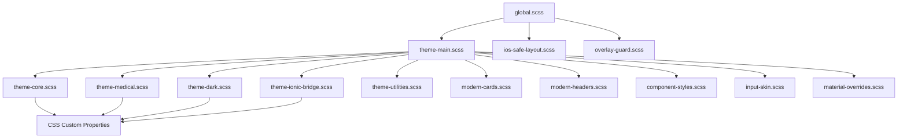

# MedicsCare Design System Guide

**Enterprise-Grade Mobile Health App Design Patterns**

This guide documents the consistent design patterns, components, and styling approach used across the MedicsCare application to ensure a modern, professional, and cohesive user experience.

---

## Table of Contents

1. [Core Principles](#core-principles)
2. [File Structure Pattern](#file-structure-pattern)
3. [HTML Structure Patterns](#html-structure-patterns)
4. [SCSS Architecture](#scss-architecture)
5. [Theme System Architecture](#theme-system-architecture) ⭐ **NEW**
6. [iOS-Safe Layout Guidelines](#ios-safe-layout-guidelines) ⭐ **NEW**
7. [Global Variables Reference](#global-variables-reference)
8. [Component Patterns](#component-patterns)
9. [Animation Standards](#animation-standards)
10. [Responsive Design](#responsive-design)
11. [Step-by-Step Redesign Checklist](#step-by-step-redesign-checklist)
12. [Examples](#examples)
13. [Platform-Specific Guidelines](#platform-specific-guidelines) ⭐ **NEW**

---

## Core Principles

### 1. **Consistency First**
- All screens follow the same structural patterns
- Reuse global.scss variables exclusively
- Never use hardcoded values (colors, spacing, fonts, shadows)

### 2. **Modern Card-Based Design**
- Replace old `ion-card` and `ion-grid` layouts with modern container/card structure
- Use white cards with subtle shadows on light gray backgrounds
- Consistent border radius and padding

### 3. **Professional Typography Hierarchy**
- Clear distinction between headers, subtitles, and body text
- Bold important information (names, titles)
- Muted secondary information (specialties, dates)

### 4. **Smooth Animations**
- All cards use `fadeInUp` animation (0.4s ease-out)
- Hover states for interactive elements
- Loading and empty states

### 5. **Icon-Driven UI**
- Use Ionic outline icons consistently
- Primary color for icons
- Icon + text pattern for detail items

### 6. **iOS-Safe Layouts** ⭐ **CRITICAL**
- Never use `100vh` - always use `var(--app-height, 100vh)`
- All fixed elements must respect safe-area insets (notch/home indicator)
- Use iOS-specific selectors (`.ios &`) for platform-specific styles
- No nested scroll containers - single scroll context per page
- Ensure Android compatibility (all iOS fixes must not affect Android)

---

## File Structure Pattern

Every page should follow this structure:

```
src/pages/[feature]/[page-name]/
├── [page-name].page.html     # Template with semantic structure
├── [page-name].page.scss     # Styles using global.scss variables
└── [page-name].page.ts       # Component logic (unchanged)
```

---

## HTML Structure Patterns

### 1. **Main Container Structure**

```html
<ion-content class="[page-name]-page">
  <div class="container">
    <!-- Header Section -->
    <header class="header">
      <h1>Page Title</h1>
      <p class="subtitle">Descriptive subtitle text</p>
    </header>

    <!-- Main Content Card -->
    <div class="main-card">
      <!-- Content here -->
    </div>

    <!-- Additional Sections -->
    <div class="record-section">
      <h3 class="section-title">Section Title</h3>
      <div class="section-content">
        <!-- Section content -->
      </div>
    </div>
  </div>
</ion-content>
```

### 2. **Detail Item Pattern** (Most Important!)

This is the core pattern for displaying information consistently:

```html
<div class="detail-item">
  <ion-icon name="[icon-name]-outline" class="detail-icon"></ion-icon>
  <div class="detail-content">
    [Main text or component]
  </div>
</div>
```

**With Doctor Information:**
```html
<div class="detail-item">
  <ion-icon name="medical-outline" class="detail-icon"></ion-icon>
  <div class="detail-content">
    <div class="doctor-name">Dr. {{ doctorName }}</div>
    <div class="specialty">{{ specialtyName }}</div>
  </div>
</div>
```

**Key Rules:**
- Always use `detail-item` as the wrapper
- Icon should be `[name]-outline` variant
- Icon gets `detail-icon` class
- Content goes in `detail-content` div
- First item in a list should have bold text automatically
- Items separated by `border-bottom: 1px solid var(--color-gray-100)`

### 3. **Empty State Pattern**

```html
<div class="empty-state" *ngIf="!hasData">
  <ion-icon name="document-text-outline" class="empty-icon"></ion-icon>
  <p>No data available message</p>
</div>
```

### 4. **Loading State Pattern**

```html
<div class="loading-container" *ngIf="isLoading">
  <ion-spinner name="crescent"></ion-spinner>
  <p class="loading-text">Loading message...</p>
</div>
```

### 5. **Section Pattern**

```html
<div class="record-section">
  <h3 class="section-title">Section Title</h3>
  <div class="section-content">
    <ul class="record-list">
      <li *ngFor="let item of items">{{ item.text }}</li>
    </ul>
  </div>
</div>
```

### 6. **Action Buttons Pattern**

```html
<div class="action-buttons">
  <ion-button expand="block" (click)="action()">
    <ion-icon slot="start" name="icon-name-outline"></ion-icon>
    Button Text
  </ion-button>

  <ion-button expand="block" color="danger" (click)="dangerAction()">
    <ion-icon slot="start" name="close-outline"></ion-icon>
    Danger Action
  </ion-button>
</div>
```

---

## SCSS Architecture

### File Header

Always start SCSS files with:

```scss
/**
 * MedicsCare [Page Name] Page
 * Professional [description] using the MedicsCare Theme System
 */
```

### Main Page Class Structure

```scss
.page-name-page {
  --padding-top: var(--mc-spacing-2xl);
  --padding-bottom: var(--mc-spacing-2xl);

  // ===================================
  // 📱 CONTAINER LAYOUT
  // ===================================

  .container {
    max-width: 800px;  // or 1000px for wider pages
    margin: 0 auto;
    padding: 0 var(--mc-spacing-xl);
  }

  // ===================================
  // 📋 HEADER SECTION
  // ===================================

  .header {
    margin-bottom: var(--mc-spacing-2xl);

    h1 {
      font-size: var(--font-heading-lg);
      font-weight: 600;
      color: var(--color-gray-900);
      margin: 0 0 var(--mc-spacing-xs) 0;
    }

    .subtitle {
      font-size: var(--font-body-md);
      color: var(--color-gray-600);
      margin: 0;
      font-weight: 400;
    }
  }

  // Additional sections...
}
```

### Standard Card Styling

```scss
.main-card,
.visit-card,
.record-section {
  background: var(--color-white);
  border-radius: var(--radius-lg);
  padding: var(--spacing-4) var(--spacing-5);
  box-shadow: var(--shadow-sm);
  margin-bottom: var(--spacing-4);
  animation: fadeInUp 0.4s ease-out;
}
```

### Detail Item Styling (Essential!)

```scss
.detail-item {
  display: flex;
  align-items: flex-start;
  padding: var(--spacing-3) 0;

  &:not(:last-child) {
    border-bottom: 1px solid var(--color-gray-100);
  }

  &:first-child .detail-content {
    font-weight: 600;
    color: var(--mc-text-primary);
  }
}

.detail-icon {
  font-size: var(--font-heading-md);
  color: var(--mc-color-primary-500);
  margin-right: var(--mc-spacing-lg);
  flex-shrink: 0;
  margin-top: 2px;
}

.detail-content {
  flex: 1;
  line-height: 1.5;
  font-size: var(--font-body-md);
  color: var(--mc-text-primary);

  .doctor-name {
    font-weight: 600;
    margin-bottom: var(--spacing-1);
    color: var(--mc-text-primary);
  }

  .specialty {
    color: var(--color-gray-600);
    font-size: var(--font-body-sm);
  }
}
```

### Section Title Styling

```scss
.section-title {
  font-size: var(--font-heading-sm);
  font-weight: 600;
  color: var(--color-gray-700);
  margin: 0 0 var(--spacing-3) 0;
}
```

### Empty/Loading States

```scss
.empty-state {
  text-align: center;
  padding: var(--spacing-6) var(--spacing-4);
  color: var(--color-gray-500);
  animation: fadeInUp 0.5s ease-out;

  .empty-icon {
    font-size: 64px;
    margin-bottom: var(--spacing-4);
    color: var(--color-gray-400);
  }

  p {
    font-size: var(--font-body-md);
    margin: 0;
  }
}

.loading-container {
  display: flex;
  flex-direction: column;
  align-items: center;
  justify-content: center;
  min-height: 200px;
  gap: var(--spacing-3);
  animation: fadeIn 0.5s ease-out;

  ion-spinner {
    width: 40px;
    height: 40px;
    --color: var(--mc-color-primary-500);
  }

  .loading-text {
    color: var(--color-gray-600);
    font-size: var(--font-body-md);
    font-weight: 500;
    margin: 0;
  }
}
```

### Required Animation

```scss
@keyframes fadeInUp {
  from {
    opacity: 0;
    transform: translateY(20px);
  }
  to {
    opacity: 1;
    transform: translateY(0);
  }
}
```

### Responsive Design (Essential!)

```scss
@media (max-width: 600px) {
  .page-name-page {
    .container {
      padding: 0 var(--mc-spacing-md);
    }

    .header h1 {
      font-size: var(--font-heading-md);
    }

    .header .subtitle {
      font-size: var(--font-body-sm);
    }

    .main-card,
    .record-section {
      padding: var(--spacing-3) var(--spacing-4);
    }

    .detail-item {
      padding: var(--spacing-2) 0;
    }
  }
}
```

---

## Theme System Architecture

### Overview

MedicsCare uses a comprehensive, enterprise-grade theme system split across multiple files for maintainability and scalability. Understanding this structure is critical for consistent development.

### File Structure

```
src/
├── global.scss                          # Main entry point - imports everything
├── theme/                               # Platform-specific utilities
│   ├── _ios-safe-layout.scss           # iOS safe-area utilities (450+ lines)
│   ├── _overlay-guard.scss             # Modal/overlay iOS safety (400+ lines)
│   └── variables.scss                  # Legacy theme variables (deprecated)
└── shared/styles/                       # Complete theme system
    ├── theme-main.scss                 # Theme orchestrator - imports all modules
    ├── theme-core.scss                 # Core design tokens (colors, spacing, typography)
    ├── theme-medical.scss              # Healthcare-specific colors (patient, appointment, bill)
    ├── theme-dark.scss                 # Dark mode support
    ├── theme-ionic-bridge.scss         # Ionic framework compatibility bridge
    ├── theme-utilities.scss            # Utility classes (margins, padding, colors)
    ├── modern-cards.scss               # Modern card component styles
    ├── modern-headers.scss             # Modern header component styles
    ├── component-styles.scss           # Buttons, forms, modals styling
    ├── input-skin.scss                 # Unified input field styling
    └── material-overrides.scss         # Angular Material component overrides
```

### Import Flow



### File Purposes

#### 🎯 Main Entry Point

**`src/global.scss`** (780 lines)
- **Purpose**: Application entry point, imports all theme modules and Ionic CSS
- **Contains**:
  - Import of complete MedicsCare theme system
  - Import of iOS-safe utilities
  - Import of Ionic framework CSS
  - Legacy variable mappings for backward compatibility
  - Typography system (responsive across devices)
  - Global utility classes
  - Custom alert and toast styling
- **When to edit**: Never directly. Use specific theme files instead.

#### 📱 Platform-Specific Utilities (src/theme/)

**`src/theme/_ios-safe-layout.scss`** (450+ lines)
- **Purpose**: iOS safe-area utilities for notch/home indicator handling
- **Contains**:
  - CSS custom properties for safe-area insets
  - Mixins for iOS-safe layouts
  - Utility classes (`.safe-full-height`, `.safe-header`, `.safe-footer`)
  - Dynamic viewport height handling
- **When to use**: Always for full-height containers, fixed headers/footers
- **Documentation**: See "iOS-Safe Layout Guidelines" section

**`src/theme/_overlay-guard.scss`** (400+ lines)
- **Purpose**: Modal and overlay iOS-safe utilities
- **Contains**:
  - Modal container safe wrappers
  - Overlay positioning utilities
  - Z-index management
  - Portal-based rendering patterns
- **When to use**: For all modals, popovers, overlays
- **Documentation**: See "iOS-Safe Layout Guidelines" section

**`src/theme/variables.scss`** (DEPRECATED - 1.3KB)
- **Purpose**: Legacy theme variables (superseded by theme-core.scss)
- **Status**: Deprecated - do not use or edit
- **Migration**: Use `var(--mc-*)` variables from theme-core.scss instead

#### 🎨 Core Theme System (src/shared/styles/)

**`src/shared/styles/theme-main.scss`** (324 lines)
- **Purpose**: Theme system orchestrator - imports all modules in correct order
- **Contains**:
  - Import statements for all theme modules
  - Theme initialization
  - Smooth transitions for theme switching
  - Accessibility enhancements (focus indicators)
  - Medical context body classes
  - Device-specific optimizations
  - Theme testing and debugging utilities
- **When to edit**: Never directly. This file manages imports only.
- **Import order**:
  1. Core theme tokens
  2. Medical context colors
  3. Dark theme support
  4. Ionic bridge
  5. Utility classes
  6. Component styles

**`src/shared/styles/theme-core.scss`**
- **Purpose**: Foundation of design system - all core design tokens
- **Contains**:
  - **Color System**: Primary, neutral, success, warning, error, info palettes
  - **Spacing Scale**: xs (4px) → 2xl (48px)
  - **Typography Scale**: Display, heading, body, button, form sizes
  - **Shadows**: sm, base, md, lg, xl
  - **Border Radius**: none, sm, base, md, lg, xl, 2xl, full
  - **Z-Index Layers**: dropdown, sticky, fixed, modal-backdrop, modal, popover, tooltip
  - **Transitions**: fast (150ms), base (200ms), slow (300ms)
  - **Breakpoints**: Mobile, tablet, desktop
- **When to use**: Reference these variables in all SCSS files
- **Example**:
  ```scss
  .my-card {
    background: var(--mc-color-neutral-50);
    padding: var(--mc-spacing-lg);
    border-radius: var(--mc-radius-lg);
    box-shadow: var(--mc-shadow-sm);
    color: var(--mc-text-primary);
  }
  ```

**`src/shared/styles/theme-medical.scss`**
- **Purpose**: Healthcare-specific contextual colors
- **Contains**:
  - **Patient Status**: active (green), inactive (gray), pending (yellow), critical (red)
  - **Appointment Status**: confirmed (green), in-progress (blue), cancelled (red)
  - **Medication Status**: active (green), discontinued (gray), allergic (red)
  - **Bill Status**: paid (green), pending (yellow), overdue (red)
  - **Lab Result Status**: normal (green), abnormal (red), pending (yellow)
  - **Vital Sign Status**: normal (green), warning (yellow), critical (red)
- **When to use**: For medical context indicators, status badges
- **Example**:
  ```scss
  .appointment-status {
    &.confirmed {
      background: var(--mc-appointment-confirmed-bg);
      color: var(--mc-appointment-confirmed-text);
      border-color: var(--mc-appointment-confirmed-border);
    }
  }
  ```

**`src/shared/styles/theme-dark.scss`**
- **Purpose**: Dark mode theme overrides
- **Contains**:
  - Dark mode color palette overrides
  - Inverted text and background colors
  - Adjusted shadows for dark backgrounds
  - Media query for system preference: `@media (prefers-color-scheme: dark)`
- **When to use**: Automatically applies when user has dark mode enabled
- **Status**: Currently disabled in global.scss (light mode only)

**`src/shared/styles/theme-ionic-bridge.scss`**
- **Purpose**: Maps MedicsCare theme tokens to Ionic CSS variables
- **Contains**:
  - `--ion-color-*` mappings to `--mc-color-*`
  - `--ion-font-*` mappings
  - `--ion-background-*` mappings
  - Ionic component CSS variable overrides
- **When to use**: Automatically applies to all Ionic components
- **Purpose**: Ensures Ionic components use MedicsCare theme

**`src/shared/styles/theme-utilities.scss`**
- **Purpose**: Utility classes for rapid development
- **Contains**:
  - Color utilities (`.text-*`, `.bg-*`, `.border-*`)
  - Spacing utilities (`.m-*`, `.p-*`, `.mt-*`, `.mb-*`, etc.)
  - Typography utilities (`.text-heading-*`, `.text-body-*`)
  - Display utilities (`.flex`, `.grid`, `.block`, `.hidden`)
  - Flexbox utilities (`.justify-*`, `.items-*`, `.gap-*`)
  - Position utilities (`.relative`, `.absolute`, `.fixed`)
  - Overflow utilities (`.overflow-hidden`, `.overflow-scroll`)
- **When to use**: For quick styling without writing custom CSS
- **Example**:
  ```html
  <div class="flex items-center justify-between p-4 bg-white rounded-lg shadow-sm">
    <span class="text-heading-md text-gray-900">Patient Name</span>
    <span class="text-body-sm text-gray-500">Active</span>
  </div>
  ```

#### 🎯 Component Styles (src/shared/styles/)

**`src/shared/styles/modern-cards.scss`**
- **Purpose**: Modern card component styles with rounded edges and shadows
- **Contains**:
  - Base card styles (`.card`, `.card-header`, `.card-body`, `.card-footer`)
  - Card variants (`.card-elevated`, `.card-outlined`, `.card-flat`)
  - Card states (`.card-hover`, `.card-clickable`, `.card-disabled`)
  - Card layouts (`.card-grid`, `.card-list`)
- **When to use**: For all card-based layouts
- **Example**:
  ```html
  <div class="card card-elevated card-clickable">
    <div class="card-header">
      <h3>Appointment Details</h3>
    </div>
    <div class="card-body">
      <p>Content here</p>
    </div>
  </div>
  ```

**`src/shared/styles/modern-headers.scss`**
- **Purpose**: Modern header component styles
- **Contains**:
  - Page header styles (`.page-header`, `.page-title`, `.page-subtitle`)
  - Section header styles (`.section-header`, `.section-title`)
  - Header variants (`.header-sticky`, `.header-elevated`)
  - Breadcrumb styles
- **When to use**: For all page and section headers
- **Example**:
  ```html
  <header class="page-header">
    <h1 class="page-title">Medical Records</h1>
    <p class="page-subtitle">View and manage your health records</p>
  </header>
  ```

**`src/shared/styles/component-styles.scss`**
- **Purpose**: Standardized component styles (buttons, forms, modals, etc.)
- **Contains**:
  - **Buttons**: primary, secondary, ghost, danger, success variants
  - **Forms**: input, textarea, select, checkbox, radio styling
  - **Modals**: modal overlay, header, body, footer, actions
  - **Tables**: table layouts, headers, rows, cells
  - **Lists**: list items, dividers, icons
  - **Badges**: status badges, count badges
  - **Tabs**: tab navigation, tab panels
  - **Accordions**: collapsible sections
- **When to use**: All standard UI components
- **Example**:
  ```html
  <button class="btn btn-primary btn-lg">
    <ion-icon name="checkmark-outline"></ion-icon>
    Confirm Appointment
  </button>
  ```

**`src/shared/styles/input-skin.scss`**
- **Purpose**: Unified input field styling across all forms
- **Contains**:
  - Base input styles with consistent padding, borders, focus states
  - Input states (default, hover, focus, disabled, error, success)
  - Input sizes (small, medium, large)
  - Input variants (outlined, filled, underlined)
  - Icon support (prefix, suffix icons)
- **When to use**: Automatically applies to all input fields
- **Variables available**:
  ```scss
  --mc-input-bg: Background color
  --mc-input-text: Text color
  --mc-input-border: Border color
  --mc-input-focus-border: Focus border color
  --mc-input-placeholder: Placeholder color
  --mc-input-padding-x: Horizontal padding
  --mc-input-padding-y: Vertical padding
  --mc-input-radius: Border radius
  ```

**`src/shared/styles/material-overrides.scss`**
- **Purpose**: Angular Material component overrides to match MedicsCare theme
- **Contains**:
  - Material dialog overrides
  - Material date picker styling
  - Material select/dropdown styling
  - Material checkbox/radio styling
  - Material form field overrides
- **When to use**: Automatically applies to all Angular Material components
- **Purpose**: Ensures Material components match the rest of the app

### How to Use the Theme System

#### ✅ Correct Usage Pattern

```scss
// ✅ Import theme variables (already available globally via global.scss)
.my-component {
  // Use theme variables
  background: var(--mc-color-neutral-50);
  color: var(--mc-text-primary);
  padding: var(--mc-spacing-lg);
  border-radius: var(--mc-radius-md);
  box-shadow: var(--mc-shadow-sm);

  // iOS-safe full height
  min-height: var(--app-height, 100vh);

  // Platform-specific
  .ios & {
    padding-top: calc(var(--mc-spacing-lg) + var(--safe-area-top));
  }
}
```

#### ❌ Incorrect Usage Pattern

```scss
// ❌ Don't import theme files in component SCSS
@import '../shared/styles/theme-core';  // Already imported globally

// ❌ Don't use hardcoded values
.my-component {
  background: #ffffff;  // Use var(--mc-color-neutral-50)
  padding: 16px;        // Use var(--mc-spacing-lg)
  border-radius: 8px;   // Use var(--mc-radius-md)

  // ❌ Don't use 100vh directly
  min-height: 100vh;    // Use var(--app-height, 100vh)
}
```

### Variable Naming Conventions

All theme variables follow a consistent naming pattern:

```scss
--mc-{category}-{property}-{variant}

Examples:
--mc-color-primary-500        // Color category, primary property, 500 variant
--mc-spacing-lg               // Spacing category, large size
--mc-text-primary             // Text category, primary variant
--mc-shadow-sm                // Shadow category, small size
--mc-radius-md                // Radius category, medium size
--mc-z-modal                  // Z-index category, modal layer
```

**Legacy mappings** (for backward compatibility):
```scss
--color-primary          →  --mc-color-primary-500
--spacing-4              →  --mc-spacing-md
--font-heading-md        →  --font-heading-md
--shadow-sm              →  --mc-shadow-sm
```

### Available Variable Categories

| Category | Prefix | Example | Count |
|----------|--------|---------|-------|
| **Colors** | `--mc-color-*` | `--mc-color-primary-500` | 50+ |
| **Text Colors** | `--mc-text-*` | `--mc-text-primary` | 10+ |
| **Background Colors** | `--mc-bg-*` | `--mc-bg-primary` | 8+ |
| **Border Colors** | `--mc-border-*` | `--mc-border-primary` | 5+ |
| **Spacing** | `--mc-spacing-*` | `--mc-spacing-lg` | 8 |
| **Typography** | `--font-*` | `--font-heading-lg` | 20+ |
| **Shadows** | `--mc-shadow-*` | `--mc-shadow-md` | 5 |
| **Radius** | `--mc-radius-*` | `--mc-radius-lg` | 7 |
| **Z-Index** | `--mc-z-*` | `--mc-z-modal` | 7 |
| **Transitions** | `--mc-transition-*` | `--mc-transition-base` | 3 |
| **Medical Context** | `--mc-patient-*`, `--mc-appointment-*`, `--mc-bill-*` | `--mc-patient-active-bg` | 50+ |
| **Input Styles** | `--mc-input-*` | `--mc-input-border` | 15+ |
| **iOS Safe Area** | `--safe-area-*`, `--app-height` | `--safe-area-top` | 5 |

### Quick Reference: Common Variables

```scss
/* 🎨 Colors */
--mc-color-primary-500        // Main primary color (#002582)
--mc-color-neutral-50         // White background
--mc-color-neutral-900        // Dark text
--mc-text-primary             // Primary text color
--mc-text-secondary           // Secondary text color
--mc-bg-primary               // Primary background
--mc-border-primary           // Primary border color

/* 📏 Spacing (4px base scale) */
--mc-spacing-xs               // 4px
--mc-spacing-sm               // 8px
--mc-spacing-md               // 16px
--mc-spacing-lg               // 24px
--mc-spacing-xl               // 32px
--mc-spacing-2xl              // 48px

/* 📝 Typography */
--font-heading-lg             // 20px - Page headings
--font-heading-md             // 18px - Card titles
--font-heading-sm             // 16px - Section headers
--font-body-lg                // 16px - Default body text
--font-body-md                // 14px - Secondary text
--font-body-sm                // 13px - Captions

/* 🎭 Effects */
--mc-shadow-sm                // Small shadow for cards
--mc-shadow-md                // Medium shadow for elevated cards
--mc-radius-md                // 8px - Standard border radius
--mc-radius-lg                // 12px - Large border radius

/* 📱 iOS Safe */
--app-height                  // Dynamic viewport height (iOS-safe)
--safe-area-top               // Top safe area (notch)
--safe-area-bottom            // Bottom safe area (home indicator)

/* 🏥 Medical Context */
--mc-patient-active-bg        // Active patient background
--mc-appointment-confirmed-text  // Confirmed appointment text color
--mc-bill-paid-bg             // Paid bill background
```

### Theme System Best Practices

1. **Never import theme files directly** - They're already available globally via `global.scss`
2. **Always use CSS custom properties** - Never hardcode colors, spacing, or typography
3. **Follow naming conventions** - Use the `--mc-*` prefix for all custom variables
4. **Test on both platforms** - Verify Android and iOS compatibility
5. **Use utility classes** - For rapid development without writing custom CSS
6. **Respect iOS safe areas** - Always use `var(--app-height, 100vh)` and safe-area variables
7. **Follow the import order** - If adding new theme files, maintain the order in theme-main.scss
8. **Document new variables** - Add comments explaining purpose and usage
9. **Test dark mode** - Even if disabled, ensure variables work in dark mode
10. **Validate with CI** - Run `npm run lint:ios` before committing

### Troubleshooting

**Problem**: Theme variables not working
- **Solution**: Check that `global.scss` is imported in your app
- **Solution**: Verify no typos in variable names (case-sensitive)
- **Solution**: Ensure you're using `var(--variable-name)` syntax

**Problem**: Colors look different than expected
- **Solution**: Check if you're using the correct shade (50, 100, 500, etc.)
- **Solution**: Verify Ionic color mappings in `theme-ionic-bridge.scss`

**Problem**: iOS layout issues
- **Solution**: Use `var(--app-height, 100vh)` instead of `100vh`
- **Solution**: Add `.ios &` selector for safe-area padding
- **Solution**: Run `npm run lint:ios` to check for violations

**Problem**: Spacing/typography inconsistent
- **Solution**: Use theme variables instead of hardcoded values
- **Solution**: Check responsive breakpoints (mobile, tablet, desktop)
- **Solution**: Verify font sizes scale correctly across devices

---

## iOS-Safe Layout Guidelines

### Overview

iOS devices (iPhone X and later) have unique display features that require special handling:
- **Notch/Dynamic Island**: Top cutout for sensors and camera
- **Home Indicator**: Bottom gesture bar for navigation
- **Rounded Corners**: Screen corners are not rectangular
- **Safari Chrome**: Browser UI can appear/disappear affecting viewport height

**Critical Rule**: ALL pages and components MUST follow these iOS-safe patterns to prevent content from being hidden under the notch or home indicator.

### Core Concepts

#### 1. Safe Area Insets

iOS provides environment variables that define the safe areas:

```scss
env(safe-area-inset-top)      // Top notch/Dynamic Island height
env(safe-area-inset-bottom)   // Bottom home indicator height
env(safe-area-inset-left)     // Left rounded corner offset
env(safe-area-inset-right)    // Right rounded corner offset
```

These values:
- Are `0px` on Android and older iPhones
- Are dynamic on iOS (e.g., `44px` top, `34px` bottom)
- Change based on device orientation

#### 2. Dynamic Viewport Height

iOS Safari's address bar appears/disappears when scrolling, changing the viewport height:

```scss
// ❌ DON'T USE - Static viewport
height: 100vh;  // Doesn't account for Safari chrome changes

// ✅ DO USE - Dynamic viewport
height: 100dvh; // Adjusts as Safari chrome appears/disappears

// ✅ BEST - Cross-platform compatible
height: var(--app-height, 100vh);  // 100dvh on iOS, 100vh on Android
```

#### 3. Platform-Specific Selectors

Use `.ios &` selector to apply styles ONLY on iOS:

```scss
.my-component {
  padding-top: 20px;  // Default for all platforms

  .ios & {
    padding-top: calc(20px + var(--safe-area-top));  // iOS only
  }
}
```

This ensures Android functionality remains unaffected.

### Required Setup

Our app includes iOS-safe utilities in `src/theme/_ios-safe-layout.scss`. These are automatically available via `src/global.scss`.

**CSS Custom Properties Available:**

```scss
--safe-area-top: env(safe-area-inset-top, 0px);
--safe-area-bottom: env(safe-area-inset-bottom, 0px);
--safe-area-left: env(safe-area-inset-left, 0px);
--safe-area-right: env(safe-area-inset-right, 0px);
--app-height: 100vh;  // Default, overridden to 100dvh on iOS
```

### Common Patterns

#### Pattern 1: Full-Height Containers

**Problem**: Content extends under notch/home indicator

**❌ DON'T USE:**
```scss
.container {
  height: 100vh;  // Static, doesn't account for Safari chrome
  padding: 20px;  // Content goes under notch
}
```

**✅ DO USE:**
```scss
.container {
  height: var(--app-height, 100vh);  // Dynamic viewport

  .ios & {
    padding-top: calc(var(--mc-spacing-xl) + var(--safe-area-top));
    padding-bottom: calc(var(--mc-spacing-xl) + var(--safe-area-bottom));
  }
}
```

**Complete Example:**
```scss
.sign-in-page {
  .background {
    width: 100vw;
    height: var(--app-height, 100vh);  // ✅ iOS-safe
    background: linear-gradient(180deg, #ffffff 0%, #f8f9fa 100%);

    .ios & {
      padding-top: var(--safe-area-top);
      padding-bottom: var(--safe-area-bottom);
    }
  }
}
```

#### Pattern 2: Fixed Headers

**Problem**: Headers overlap with notch

**❌ DON'T USE:**
```scss
.header {
  position: fixed;
  top: 0;
  left: 0;
  right: 0;
  height: 60px;
  background: white;
}
```

**✅ DO USE:**
```scss
.header {
  position: fixed;
  top: 0;
  left: 0;
  right: 0;
  height: 60px;
  background: white;

  .ios & {
    padding-top: var(--safe-area-top);
    height: calc(60px + var(--safe-area-top));
  }
}
```

**Alternative - Use Utility Class:**
```scss
.header {
  @include safe-area-top(60px);  // Automatically adds safe-area-top
  position: fixed;
  top: 0;
  background: white;
}
```

#### Pattern 3: Fixed Footers

**Problem**: Buttons hidden under home indicator

**❌ DON'T USE:**
```scss
.footer {
  position: fixed;
  bottom: 0;
  left: 0;
  right: 0;
  padding: 20px;
}
```

**✅ DO USE:**
```scss
.footer {
  position: fixed;
  bottom: 0;
  left: 0;
  right: 0;
  padding: var(--mc-spacing-lg);

  .ios & {
    padding-bottom: calc(var(--mc-spacing-lg) + var(--safe-area-bottom));
  }
}
```

#### Pattern 4: Modals and Overlays

**Problem**: Modal content cut off by notch, hard to dismiss at bottom

**❌ DON'T USE:**
```scss
.modal-overlay {
  position: fixed;
  top: 0;
  bottom: 0;
  left: 0;
  right: 0;
  height: 100vh;
  background: rgba(0, 0, 0, 0.5);
}

.modal-content {
  padding: 20px;
}
```

**✅ DO USE:**
```scss
.modal-overlay {
  position: fixed;
  top: 0;
  bottom: 0;
  left: 0;
  right: 0;
  height: var(--app-height, 100vh);  // ✅ Dynamic viewport
  background: rgba(0, 0, 0, 0.5);

  .ios & {
    padding-top: var(--safe-area-top);
    padding-bottom: var(--safe-area-bottom);
  }
}

.modal-content {
  padding: var(--mc-spacing-lg);

  .ios & {
    padding-top: calc(var(--mc-spacing-lg) + var(--safe-area-top));
    padding-bottom: calc(var(--mc-spacing-lg) + var(--safe-area-bottom));
  }
}
```

**Best Practice - Use Ionic Components:**
```typescript
// Ionic's ModalController automatically handles safe areas
const modal = await this.modalController.create({
  component: MyModalComponent,
  cssClass: 'my-modal'  // Add additional styling if needed
});
```

#### Pattern 5: Scrollable Content with Fixed Footer

**Problem**: Footer overlaps content, content hidden under home indicator

**❌ DON'T USE:**
```scss
.page-content {
  padding-bottom: 80px;  // Fixed footer height
}

.fixed-footer {
  position: fixed;
  bottom: 0;
  height: 80px;
}
```

**✅ DO USE:**
```scss
.page-content {
  padding-bottom: 80px;  // Default

  .ios & {
    padding-bottom: calc(80px + var(--safe-area-bottom));
  }
}

.fixed-footer {
  position: fixed;
  bottom: 0;
  height: 80px;

  .ios & {
    height: calc(80px + var(--safe-area-bottom));
    padding-bottom: var(--safe-area-bottom);
  }
}
```

#### Pattern 6: Keyboard-Aware Forms

**Problem**: iOS keyboard covers input fields

**✅ USE:**
```scss
.form-container {
  min-height: var(--app-height, 100vh);
  padding-bottom: var(--mc-spacing-2xl);

  .ios & {
    // When keyboard appears, Ionic automatically adjusts ion-content
    // Just ensure proper padding at bottom
    padding-bottom: calc(var(--mc-spacing-2xl) + var(--safe-area-bottom));
  }
}
```

**TypeScript Enhancement:**
```typescript
import { Keyboard } from '@capacitor/keyboard';

// Listen for keyboard show/hide
Keyboard.addListener('keyboardWillShow', info => {
  document.documentElement.style.setProperty('--keyboard-height', `${info.keyboardHeight}px`);
});

Keyboard.addListener('keyboardWillHide', () => {
  document.documentElement.style.setProperty('--keyboard-height', '0px');
});
```

### Utility Classes Available

The `_ios-safe-layout.scss` provides ready-to-use classes:

```scss
// Full-height containers
.safe-full-height {
  height: var(--app-height, 100vh);

  .ios & {
    padding-top: var(--safe-area-top);
    padding-bottom: var(--safe-area-bottom);
  }
}

// Fixed headers
.safe-header {
  .ios & {
    padding-top: var(--safe-area-top);
  }
}

// Fixed footers
.safe-footer {
  .ios & {
    padding-bottom: var(--safe-area-bottom);
  }
}

// Containers with safe padding
.safe-container {
  .ios & {
    padding-top: calc(var(--mc-spacing-xl) + var(--safe-area-top));
    padding-bottom: calc(var(--mc-spacing-xl) + var(--safe-area-bottom));
    padding-left: calc(var(--mc-spacing-xl) + var(--safe-area-left));
    padding-right: calc(var(--mc-spacing-xl) + var(--safe-area-right));
  }
}
```

**Usage in HTML:**
```html
<ion-content class="sign-in-page">
  <div class="background safe-full-height">
    <!-- Content automatically respects safe areas -->
  </div>
</ion-content>
```

### Testing Your iOS Layouts

#### In Browser (Chrome DevTools)
1. Open DevTools (F12)
2. Toggle device toolbar (Ctrl+Shift+M)
3. Select "iPhone 14 Pro" or "iPhone 15 Pro Max"
4. Check:
   - Content doesn't overlap top notch
   - Buttons visible above home indicator
   - Scrolling works smoothly
   - No content jumps when scrolling

#### On Real Device (Recommended)
```bash
# Build and run on iOS device
npm run build
npx cap copy ios
npx cap open ios
# Run from Xcode on physical device
```

**What to Test:**
- [ ] Content visible below notch/Dynamic Island
- [ ] All buttons accessible above home indicator
- [ ] Modals fully visible with safe spacing
- [ ] Scrolling smooth, no jumps
- [ ] Keyboard doesn't cover input fields
- [ ] Landscape orientation works correctly

### Common Mistakes to Avoid

#### ❌ Mistake 1: Using 100vh directly
```scss
.container {
  height: 100vh;  // ❌ Broken on iOS
}
```
**Fix:**
```scss
.container {
  height: var(--app-height, 100vh);  // ✅ Works everywhere
}
```

#### ❌ Mistake 2: Fixed positioning without safe-area
```scss
.header {
  position: fixed;
  top: 0;  // ❌ Goes under notch
}
```
**Fix:**
```scss
.header {
  position: fixed;
  top: 0;

  .ios & {
    padding-top: var(--safe-area-top);  // ✅ Respects notch
  }
}
```

#### ❌ Mistake 3: Hardcoded safe-area values
```scss
.ios & {
  padding-top: 44px;  // ❌ Wrong on different devices
}
```
**Fix:**
```scss
.ios & {
  padding-top: var(--safe-area-top);  // ✅ Dynamic per device
}
```

#### ❌ Mistake 4: Forgetting Android compatibility
```scss
.container {
  .ios & {
    padding-top: var(--safe-area-top);
  }
  // ❌ No fallback for Android
}
```
**Fix:**
```scss
.container {
  padding-top: var(--mc-spacing-lg);  // ✅ Default for all

  .ios & {
    padding-top: calc(var(--mc-spacing-lg) + var(--safe-area-top));  // ✅ iOS adds safe area
  }
}
```

#### ❌ Mistake 5: Nested scroll containers
```scss
.outer-scroll {
  overflow-y: auto;

  .inner-scroll {
    overflow-y: auto;  // ❌ Causes scroll jumps on iOS
  }
}
```
**Fix:**
```scss
// Use single scroll container (ion-content)
<ion-content>
  <div class="content">
    <!-- All content scrolls as one -->
  </div>
</ion-content>
```

### CI/CD Integration

A lint script automatically checks for iOS anti-patterns:

```bash
# Check all files
npm run lint:ios

# Check only git-staged files (in pre-commit hook)
npm run lint:ios:git
```

**Detected Issues:**
- ❌ **Error**: Direct use of `100vh` without `var(--app-height)`
- ⚠️ **Warning**: `position: fixed` without safe-area handling
- ⚠️ **Warning**: Transform properties on potential overlay parents
- ⚠️ **Warning**: Nested scroll containers

### Quick Reference Card

| Scenario | ❌ Don't Use | ✅ Do Use |
|----------|-------------|-----------|
| **Full Height** | `height: 100vh` | `height: var(--app-height, 100vh)` |
| **Fixed Header** | `top: 0` | `top: 0` + `.ios & { padding-top: var(--safe-area-top) }` |
| **Fixed Footer** | `bottom: 0` | `bottom: 0` + `.ios & { padding-bottom: var(--safe-area-bottom) }` |
| **Modal Height** | `height: 100vh` | `height: var(--app-height, 100vh)` |
| **Safe Area Padding** | `padding: 44px` | `padding-top: var(--safe-area-top)` |
| **Scroll Container** | Nested `overflow: auto` | Single `ion-content` |

### Real-World Examples from Codebase

#### Example: Sign-In Page (✅ CORRECT)

```scss
// src/pages/login/sign-in/sign-in.page.scss
.sign-in-page {
  @mixin full-width-height {
    width: 100vw;
    height: var(--app-height, 100vh);  // ✅ iOS-safe
  }

  .background {
    @include full-width-height;

    .ios & {
      padding-top: var(--safe-area-top);
      padding-bottom: var(--safe-area-bottom);
    }
  }
}
```

#### Example: Home Template (✅ CORRECT)

```scss
// src/pages/home/home-template/home-template.page.scss
.main-container {
  min-height: var(--app-height, 100vh);
  padding-bottom: 85px;  // Footer height

  .ios & {
    padding-bottom: calc(85px + var(--safe-area-bottom));  // ✅ Footer clears home indicator
  }
}
```

#### Example: Family Member Selector Modal (✅ CORRECT)

```scss
// src/components/family-member-selector/family-member-selector.component.scss
.modal-overlay {
  position: fixed;
  height: var(--app-height, 100vh);  // ✅ iOS-safe

  .ios & {
    padding-top: calc(var(--mc-spacing-lg) + var(--safe-area-top));
    padding-bottom: calc(var(--mc-spacing-lg) + var(--safe-area-bottom));
  }
}
```

### Summary: Golden Rules for iOS

1. ✅ **ALWAYS** use `var(--app-height, 100vh)` instead of `100vh`
2. ✅ **ALWAYS** add `.ios &` selector for safe-area padding
3. ✅ **ALWAYS** test on actual iOS device before deploying
4. ✅ **ALWAYS** provide Android-compatible fallbacks
5. ✅ **ALWAYS** use `env(safe-area-inset-*)` via CSS custom properties
6. ✅ **ALWAYS** run `npm run lint:ios` before committing
7. ❌ **NEVER** use hardcoded safe-area values (e.g., `44px`)
8. ❌ **NEVER** create nested scroll containers
9. ❌ **NEVER** use `100vh` directly in any SCSS file
10. ❌ **NEVER** skip iOS testing "because it works on Android"

---

## Global Variables Reference

### Colors

**DO USE:**
```scss
// Grays
var(--color-gray-50)
var(--color-gray-100)
var(--color-gray-200)
var(--color-gray-300)
var(--color-gray-400)
var(--color-gray-500)
var(--color-gray-600)
var(--color-gray-700)
var(--color-gray-800)
var(--color-gray-900)

// White
var(--color-white)

// Primary
var(--mc-color-primary-50)
var(--mc-color-primary-100)
var(--mc-color-primary-500)
var(--mc-color-primary-600)
var(--mc-color-primary-700)

// Status Colors
var(--mc-color-success-500)
var(--mc-color-success-600)
var(--mc-color-error-500)
var(--mc-color-error-600)
var(--mc-color-warning-500)
var(--mc-color-warning-600)

// Text
var(--mc-text-primary)
var(--mc-text-secondary)
var(--mc-text-tertiary)
```

**DON'T USE:**
- Hardcoded hex colors: `#111827` ❌
- RGB values: `rgb(17, 24, 39)` ❌

### Spacing

**DO USE:**
```scss
var(--spacing-1)    // 4px
var(--spacing-2)    // 8px
var(--spacing-3)    // 12px
var(--spacing-4)    // 16px
var(--spacing-5)    // 20px
var(--spacing-6)    // 24px

var(--mc-spacing-xs)
var(--mc-spacing-sm)
var(--mc-spacing-md)
var(--mc-spacing-lg)
var(--mc-spacing-xl)
var(--mc-spacing-2xl)
```

**DON'T USE:**
- Hardcoded pixels: `12px` ❌
- Hardcoded rems: `0.75rem` ❌

### Typography

**DO USE:**
```scss
// Headings
var(--font-heading-lg)
var(--font-heading-md)
var(--font-heading-sm)

// Body
var(--font-body-lg)
var(--font-body-md)
var(--font-body-sm)
var(--font-body-xs)
```

**DON'T USE:**
- Hardcoded sizes: `1.5rem` ❌
- Pixel values: `18px` ❌

### Shadows

**DO USE:**
```scss
var(--shadow-xs)
var(--shadow-sm)
var(--shadow-md)
var(--shadow-lg)
```

**DON'T USE:**
- Custom shadows: `0 1px 3px rgba(0,0,0,0.1)` ❌

### Border Radius

**DO USE:**
```scss
var(--radius-sm)
var(--radius-md)
var(--radius-lg)
var(--radius-full)
```

**DON'T USE:**
- Hardcoded radius: `8px` ❌

---

## Component Patterns

### 1. Status Badge

```html
<div class="status-badge" [class.status-scheduled]="status === 'SCHEDULED'">
  {{ status }}
</div>
```

```scss
.status-badge {
  padding: var(--spacing-1) var(--spacing-3);
  border-radius: var(--radius-full);
  font-size: var(--font-body-sm);
  font-weight: 600;
  background: var(--color-gray-100);
  color: var(--color-gray-700);

  &.status-scheduled {
    background: var(--mc-color-primary-100);
    color: var(--mc-color-primary-700);
  }
}
```

### 2. Payment Section

```html
<div class="payment-section">
  <div class="payment-info">
    <span class="payment-label">PAID:</span>
    <span class="payment-amount">₹{{ amount }}.00</span>
  </div>
  <ion-button fill="clear" class="receipt-button">
    <ion-icon slot="start" name="receipt-outline"></ion-icon>
    View receipt
  </ion-button>
</div>
```

```scss
.payment-section {
  display: flex;
  justify-content: space-between;
  align-items: center;
  margin: var(--spacing-4) 0;
  padding: var(--spacing-3);
  background: var(--color-gray-50);
  border-radius: var(--radius-md);
  gap: var(--spacing-3);
  flex-wrap: wrap;

  .payment-info {
    display: flex;
    align-items: center;
    gap: var(--spacing-2);

    .payment-label {
      color: var(--color-gray-600);
      font-size: var(--font-body-sm);
      font-weight: 500;
    }

    .payment-amount {
      color: var(--mc-text-primary);
      font-size: var(--font-body-md);
      font-weight: 600;
    }
  }

  .receipt-button {
    --color: var(--mc-color-primary-500);
    font-weight: 500;
  }
}
```

### 3. Action Buttons

```scss
.action-buttons {
  margin-top: var(--spacing-6);
  padding-top: var(--spacing-4);
  border-top: 2px solid var(--color-gray-100);
  display: flex;
  flex-direction: column;
  gap: var(--spacing-3);

  ion-button {
    --border-radius: var(--radius-md);
    --padding-top: var(--spacing-3);
    --padding-bottom: var(--spacing-3);
    --box-shadow: var(--shadow-sm);
    font-weight: 600;
    text-transform: capitalize;

    // Primary button
    &:not([color]) {
      --background: linear-gradient(90deg, var(--color-primary-500), var(--color-primary-700));
      --color: var(--color-white);
    }

    // Danger button
    &[color="danger"] {
      --background: var(--mc-color-error-500);
      --color: var(--color-white);
    }

    // Warning button
    &[color="warning"] {
      --background: var(--mc-color-warning-500);
      --color: var(--color-white);
    }

    // Success button
    &[color="success"] {
      --background: var(--mc-color-success-500);
      --color: var(--color-white);
    }

    ion-icon {
      margin-right: var(--spacing-1);
    }
  }
}
```

### 4. Prescription List

```html
<div class="prescription-list">
  <div class="prescription-item" *ngFor="let rx of prescriptions; index as i">
    <span class="prescription-number">{{i+1}}.</span>
    <div class="prescription-details">
      <div class="drug-name">{{ rx.drugName }}</div>
      <div class="dosage-info">{{ rx.dosage }} x {{ rx.duration }}</div>
    </div>
  </div>
</div>
```

```scss
.prescription-list {
  display: flex;
  flex-direction: column;
  gap: var(--spacing-3);
}

.prescription-item {
  display: flex;
  gap: var(--spacing-3);
  padding: var(--spacing-3);
  background: var(--color-gray-50);
  border-radius: var(--radius-md);
  border-left: 3px solid var(--mc-color-primary-500);
}

.prescription-number {
  font-weight: 700;
  color: var(--mc-color-primary-500);
  font-size: var(--font-body-md);
  flex-shrink: 0;
}

.prescription-details {
  flex: 1;

  .drug-name {
    font-weight: 600;
    color: var(--mc-text-primary);
    font-size: var(--font-body-md);
    margin-bottom: var(--spacing-1);
  }

  .dosage-info {
    color: var(--color-gray-600);
    font-size: var(--font-body-sm);
  }
}
```

---

## Animation Standards

### Standard Animations to Include

```scss
// Fade in from bottom (most common)
@keyframes fadeInUp {
  from {
    opacity: 0;
    transform: translateY(20px);
  }
  to {
    opacity: 1;
    transform: translateY(0);
  }
}

// Simple fade in
@keyframes fadeIn {
  from {
    opacity: 0;
  }
  to {
    opacity: 1;
  }
}

// Slide down (for headers)
@keyframes slideDown {
  from {
    opacity: 0;
    transform: translateY(-10px);
  }
  to {
    opacity: 1;
    transform: translateY(0);
  }
}
```

### Animation Application

```scss
// Cards
.main-card,
.record-section {
  animation: fadeInUp 0.4s ease-out;
}

// Empty/Loading states
.empty-state,
.loading-container {
  animation: fadeIn 0.5s ease-out;
}

// Interactive elements
.detail-item {
  transition: all 0.2s ease;

  &:hover {
    background: var(--color-gray-50);
  }
}
```

---

## Responsive Design

### Breakpoints

- **Mobile**: `max-width: 600px` (primary breakpoint)
- **Tablet**: `max-width: 768px` (secondary)
- **Desktop**: Above 768px (default)

### Standard Responsive Pattern

```scss
@media (max-width: 600px) {
  .page-name-page {
    // Container
    .container {
      padding: 0 var(--mc-spacing-md);
    }

    // Headers
    .header h1 {
      font-size: var(--font-heading-md);
    }

    .header .subtitle {
      font-size: var(--font-body-sm);
    }

    // Cards
    .main-card,
    .record-section {
      padding: var(--spacing-3) var(--spacing-4);
    }

    // Detail items
    .detail-item {
      padding: var(--spacing-2) 0;
    }

    // Flex layouts
    .payment-section {
      flex-direction: column;
      align-items: flex-start;
    }

    // Action buttons
    .action-buttons {
      gap: var(--spacing-2);

      ion-button {
        --padding-top: var(--spacing-2);
        --padding-bottom: var(--spacing-2);
      }
    }
  }
}
```

---

## Step-by-Step Redesign Checklist

Use this checklist when redesigning any page:

### Phase 1: HTML Restructure

- [ ] Add page class to `<ion-content>` (e.g., `class="page-name-page"`)
- [ ] Add `.container` div wrapper (max-width centered)
- [ ] Add `.header` section with `<h1>` and `.subtitle`
- [ ] Replace `ion-card` with semantic `div` elements
- [ ] Convert to `.detail-item` pattern for all info rows
- [ ] Add `.section-title` for all section headers
- [ ] Wrap sections in `.record-section` or similar semantic div
- [ ] Add empty state with `.empty-state` class
- [ ] Add loading state with `.loading-container` class
- [ ] Add "Dr." prefix to all doctor names
- [ ] Use outline icons consistently

### Phase 2: SCSS Redesign

- [ ] Add file header comment
- [ ] Add page class wrapper (`.page-name-page`)
- [ ] Add organized section comments (📱 📋 etc.)
- [ ] Replace ALL hardcoded colors with `var(--color-*)` or `var(--mc-color-*)`
- [ ] Replace ALL spacing with `var(--spacing-*)` or `var(--mc-spacing-*)`
- [ ] Replace ALL fonts with `var(--font-*)`
- [ ] Replace ALL shadows with `var(--shadow-*)`
- [ ] Replace ALL border-radius with `var(--radius-*)`
- [ ] Add `.container` max-width and centering
- [ ] Add `.header` styling
- [ ] Add `.detail-item`, `.detail-icon`, `.detail-content` pattern
- [ ] Add `.section-title` styling
- [ ] Add card/section background, radius, shadow, padding
- [ ] Add `fadeInUp` animation keyframes
- [ ] Apply animations to cards
- [ ] Add responsive `@media (max-width: 600px)` section
- [ ] Test all spacing, colors, and fonts use global variables

### Phase 3: iOS-Safe Layout ⭐ **CRITICAL**

- [ ] Replace ALL `100vh` with `var(--app-height, 100vh)`
- [ ] Replace ALL `min-height: 100vh` with `min-height: var(--app-height, 100vh)`
- [ ] Replace ALL `max-height: 100vh` with `max-height: var(--app-height, 100vh)`
- [ ] Add `.ios &` selector for all full-height containers
- [ ] Add safe-area-top padding to fixed headers
- [ ] Add safe-area-bottom padding to fixed footers
- [ ] Add safe-area padding to modals and overlays
- [ ] Check for nested scroll containers (remove if found)
- [ ] Ensure position:fixed elements have iOS-safe padding
- [ ] Run `npm run lint:ios` to check for violations
- [ ] Test on iOS device or iPhone simulator
- [ ] Verify Android functionality still works

### Phase 4: Quality Check

**Design System:**
- [ ] No hardcoded colors anywhere
- [ ] No hardcoded spacing values
- [ ] No hardcoded font sizes
- [ ] All cards have white background
- [ ] All cards have border-radius
- [ ] All cards have box-shadow
- [ ] All cards animate on load
- [ ] Headers have correct hierarchy
- [ ] Icons are outline variants
- [ ] Icons are primary color
- [ ] Doctor names prefixed with "Dr."
- [ ] Specialties are muted color
- [ ] Responsive design works on mobile
- [ ] Empty states display correctly
- [ ] Loading states display correctly

**iOS-Safe Layout:**
- [ ] No direct usage of `100vh` anywhere
- [ ] All full-height containers use `var(--app-height, 100vh)`
- [ ] Fixed headers have `.ios &` with safe-area-top padding
- [ ] Fixed footers have `.ios &` with safe-area-bottom padding
- [ ] Modals/overlays have iOS-safe padding
- [ ] No nested scroll containers
- [ ] `npm run lint:ios` passes without errors
- [ ] Tested on iOS device or simulator
- [ ] Android functionality unaffected

---

## Examples

### Example 1: Appointment Details Page

**Before:**
```html
<ion-grid>
  <ion-row>
    <ion-col>Patient: {{ name }}</ion-col>
  </ion-row>
</ion-grid>
```

**After:**
```html
<div class="container">
  <header class="header">
    <h1>Appointment Details</h1>
    <p class="subtitle">View and manage your appointment</p>
  </header>

  <div class="appointment-card">
    <div class="appointment-details">
      <div class="detail-item">
        <ion-icon name="person-outline" class="detail-icon"></ion-icon>
        <div class="detail-content">{{ name }}</div>
      </div>
    </div>
  </div>
</div>
```

### Example 2: SCSS Variables

**Before:**
```scss
.card {
  background: white;
  padding: 16px;
  margin: 12px;
  border-radius: 8px;
  box-shadow: 0 1px 3px rgba(0,0,0,0.1);
  color: #333;
}
```

**After:**
```scss
.card {
  background: var(--color-white);
  padding: var(--spacing-4);
  margin: var(--spacing-3);
  border-radius: var(--radius-md);
  box-shadow: var(--shadow-sm);
  color: var(--mc-text-primary);
  animation: fadeInUp 0.4s ease-out;
}
```

### Example 3: Doctor Information

**Before:**
```html
<div>{{ doctorName }}</div>
<div>{{ specialty }}</div>
```

**After:**
```html
<div class="detail-item">
  <ion-icon name="medical-outline" class="detail-icon"></ion-icon>
  <div class="detail-content">
    <div class="doctor-name">Dr. {{ doctorName }}</div>
    <div class="specialty">{{ specialty }}</div>
  </div>
</div>
```

---

## Common Patterns Quick Reference

### Header Pattern
```html
<header class="header">
  <h1>Title</h1>
  <p class="subtitle">Subtitle</p>
</header>
```

### Detail Item Pattern
```html
<div class="detail-item">
  <ion-icon name="icon-outline" class="detail-icon"></ion-icon>
  <div class="detail-content">Content</div>
</div>
```

### Section Pattern
```html
<div class="record-section">
  <h3 class="section-title">Title</h3>
  <div class="section-content">Content</div>
</div>
```

### Status Badge Pattern
```html
<div class="status-badge" [class.status-active]="isActive">
  {{ status }}
</div>
```

### List Pattern
```html
<ul class="record-list">
  <li *ngFor="let item of items">{{ item }}</li>
</ul>
```

---

## Platform-Specific Guidelines

### iOS-Specific Considerations

**Viewport Handling:**
- iOS Safari's dynamic toolbar affects viewport height
- Always use `var(--app-height, 100vh)` instead of `100vh`
- Use `100dvh` internally for iOS, `100vh` for Android

**Safe Areas:**
- iPhone X+ devices have notch, Dynamic Island, home indicator
- Always respect safe-area insets using CSS env() variables
- Use `.ios &` selector for platform-specific styles
- Never hardcode safe-area values (they differ per device)

**Scrolling:**
- Avoid nested scroll containers (causes scroll jumps)
- Use single `ion-content` per page for scrolling
- Ionic handles iOS momentum scrolling automatically

**Modals:**
- Use Ionic's ModalController for proper safe-area handling
- Add iOS-safe padding to custom modals
- Test dismissal gesture at bottom of screen

**Keyboard:**
- Ionic automatically adjusts content when keyboard appears
- Ensure bottom padding accounts for safe-area + keyboard
- Test input fields at bottom of screen

### Android-Specific Considerations

**Viewport:**
- Standard `100vh` works correctly
- No safe-area concerns (rectangular screens)
- Navigation bar handled by system

**Back Button:**
- Hardware/software back button must work correctly
- Register back button handlers in TypeScript
- Test back navigation flow thoroughly

**Permissions:**
- Camera, storage, location require runtime permissions
- Implement proper permission request flows
- Provide clear permission rationale to users

### Cross-Platform Best Practices

**Platform Detection:**
```typescript
import { Platform } from '@ionic/angular';

constructor(private platform: Platform) {
  if (this.platform.is('ios')) {
    // iOS-specific logic
  }

  if (this.platform.is('android')) {
    // Android-specific logic
  }
}
```

**CSS Platform Classes:**
```scss
// Automatically applied by Ionic
.ios & {
  // iOS-only styles
}

.android & {
  // Android-only styles
}
```

**Testing Checklist:**
- [ ] Test on actual iOS device (not just simulator)
- [ ] Test on actual Android device
- [ ] Test different iPhone models (standard, Plus/Max, mini)
- [ ] Test different Android screen sizes
- [ ] Test portrait and landscape orientations
- [ ] Test with different iOS versions
- [ ] Test with different Android versions
- [ ] Verify safe-area handling on iPhone X+
- [ ] Verify back button behavior on Android
- [ ] Test keyboard behavior on both platforms
- [ ] Verify modal dismissal gestures

---

## Summary

**Golden Rules - Design System:**

1. ✅ **Always use global.scss variables**
2. ✅ **Always use the detail-item pattern**
3. ✅ **Always add header with title + subtitle**
4. ✅ **Always use white cards on gray background**
5. ✅ **Always add fadeInUp animation to cards**
6. ✅ **Always add responsive design at 600px**
7. ✅ **Always use outline icons with primary color**
8. ✅ **Always prefix doctors with "Dr."**
9. ✅ **Always mute secondary text (specialty, dates)**
10. ✅ **Always organize SCSS with section comments**

**Golden Rules - iOS Safety:**

11. ✅ **Always use `var(--app-height, 100vh)` instead of `100vh`**
12. ✅ **Always add `.ios &` selector for safe-area padding**
13. ✅ **Always test on actual iOS device**
14. ✅ **Always run `npm run lint:ios` before committing**
15. ✅ **Always provide Android-compatible fallbacks**

**Never:**

1. ❌ Never use hardcoded colors, spacing, fonts
2. ❌ Never use `ion-grid` for layouts (use flex/div)
3. ❌ Never skip animations
4. ❌ Never skip responsive design
5. ❌ Never use filled icons (always outline)
6. ❌ Never skip empty/loading states
7. ❌ **Never use `100vh` directly** ⭐ **CRITICAL**
8. ❌ **Never skip iOS safe-area handling** ⭐ **CRITICAL**
9. ❌ **Never create nested scroll containers**
10. ❌ **Never assume "works on Android" means "works on iOS"**

---

**This guide ensures every screen in MedicsCare has the same modern, professional, enterprise-grade appearance with consistent spacing, colors, typography, animations, cross-platform compatibility, and iOS-safe layouts for a flawless user experience on all devices.**
