# MedicsCare App - Complete Route Map
**Generated**: 2025-10-12
**Purpose**: Complete visualization of all routes, pages, and navigation flows

---

## 🗺️ Quick Navigation
- [Authentication Flow](#authentication-flow)
- [Home Dashboard](#home-dashboard)
- [Appointments Module](#appointments-module)
- [Medical Records (EMR)](#medical-records-emr)
- [Prescriptions](#prescriptions)
- [Bills & Payments](#bills--payments)
- [Family Management](#family-management)
- [Profile & Settings](#profile--settings)
- [Documents & Attachments](#documents--attachments)
- [Customer Service](#customer-service)
- [Admin Features](#admin-features)
- [Unused/Legacy Pages](#unusedlegacy-pages)

---

## 📊 Route Statistics

| Category | Active Routes | Modal/Popups | Legacy/Unused |
|----------|---------------|--------------|---------------|
| Authentication | 3 | 0 | 0 |
| Appointments | 10 | 1 | 2 |
| Medical Records | 4 | 1 | 1 |
| Prescriptions | 3 | 0 | 0 |
| Bills | 2 | 0 | 0 |
| Family | 2 | 1 | 0 |
| Profile | 2 | 0 | 1 |
| Attachments | 4 | 2 | 0 |
| Customer Service | 2 | 1 | 0 |
| Admin | 4 | 0 | 1 |
| **Total** | **36** | **6** | **5** |

---

## Authentication Flow

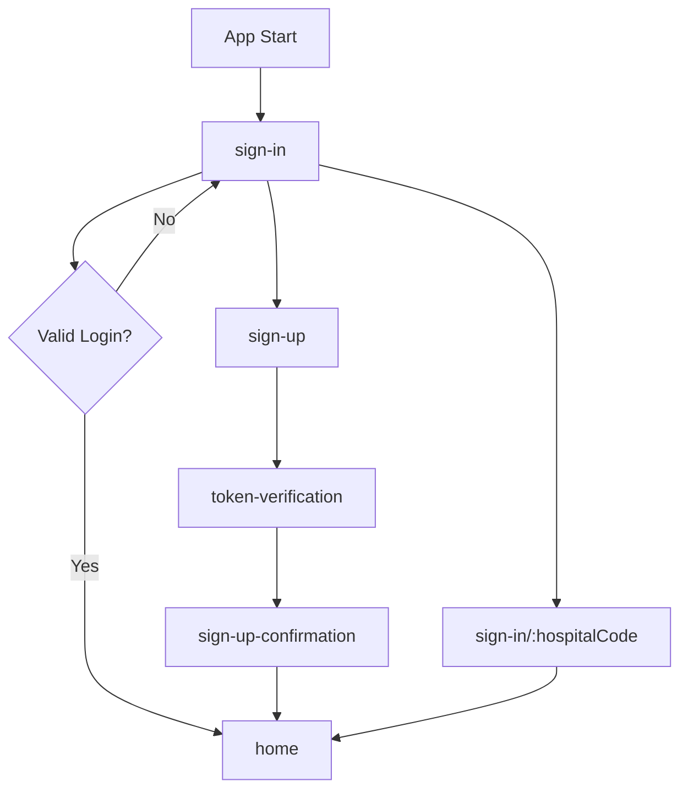

### Routes

| Route | Component | Purpose | Status |
|-------|-----------|---------|--------|
| `/sign-in` | SignInPage | Main login screen | ✅ Active |
| `/sign-in/:hospitalCode` | SignInPage | Login with hospital code | ✅ Active |
| `/sign-up` | SignUpPage | New user registration | ✅ Active |
| `/token-verification` | TokenVerificationPage | OTP verification | ✅ Active |
| `/home/sign-up-confirmation` | SignUpConfirmationPage | Registration success | ✅ Active |

### Flow Description
1. **App Launch** → Redirects to sign-in
2. **Sign In** → Validates credentials → Home
3. **Sign Up** → OTP Verification → Confirmation → Home
4. **Hospital Code Login** → Direct sign-in with pre-filled hospital

---

## Home Dashboard

```mermaid
graph TD
    HOME[🏠 Home Dashboard] --> QA1[📅 Book Appointment]
    HOME --> QA2[🗓️ My Appointments]
    HOME --> QA3[📋 Medical Records]
    HOME --> QA4[💊 Prescriptions]
    HOME --> QA5[💳 Bills]
    HOME --> QA6[🤖 AI Assessment]

    QA1 --> APT[appointment-list]
    QA2 --> APT
    QA3 --> EMR[medical-record]
    QA4 --> RX[prescription-visits]
    QA5 --> BILLS[bills]
    QA6 --> AI[patient-assessment]
```

### Routes

| Route | Component | Accessed From | Status |
|-------|-----------|---------------|--------|
| `/home` | HomePage | Login success | ✅ Active |
| `/home/appointment-list` | AppointmentListPage | "Book Appointment" / "My Appointments" | ✅ Active |
| `/home/medical-record` | visitsPage (EMR) | "Medical Records" quick action | ✅ Active |
| `/home/prescription-visits` | PrescriptionVisitsPage | "Prescriptions" quick action | ✅ Active |
| `/home/bills` | BillsPage | "Bills" quick action | ✅ Active |
| `/patient-assessment` | PatientAssessmentPage | "AI Assessment" (commented out) | ✅ Active |

### Key Features
- **Greeting**: Shows selected family member or user name
- **Upcoming Appointments**: Banner for today/upcoming appointments
- **Advertisements**: Rotating banner (server-fetched)
- **Quick Actions**: 5 main action tiles
- **Family Member Selector**: Global selection affects all modules

---

## Appointments Module

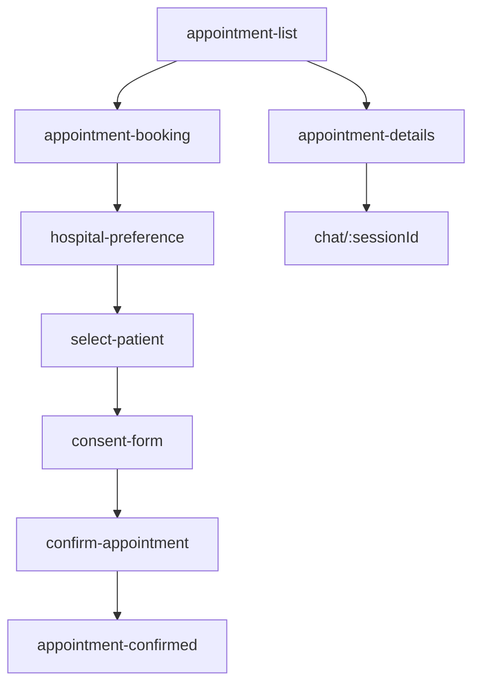

### Routes

| Route | Component | Purpose | Status |
|-------|-----------|---------|--------|
| `/home/appointment-list` | AppointmentListPage | View all appointments (tabs: New/Upcoming/History) | ✅ Active |
| `/home/appointment-booking` | AppointmentBookingPage | Select doctor, date, time | ✅ Active |
| `/home/hospital-preference` | HospitalPreferencePage | Choose preferred hospital | ✅ Active |
| `/home/select-patient` | SelectPatientPage | Choose patient (family member) | ✅ Active |
| `/home/consent-form` | ConsentFormPage | Sign consent for appointment | ✅ Active |
| `/home/confirm-appointment` | ConfirmAppointmentPage | Review & confirm booking | ✅ Active |
| `/home/appointment-confirmed` | AppointmentConfirmedPage | Success confirmation | ✅ Active |
| `/home/appointment-details` | AppointmentDetailsPage | View appointment details, join video | ✅ Active |
| `/chat/:sessionId` | ChatPage | Video consultation chat | ✅ Active |

### Flow Description
1. **List** → User views appointments in 3 tabs
2. **Book New** → Hospital → Doctor → Date/Time → Patient → Consent → Confirm → Success
3. **View Details** → Can join video consultation or chat
4. **Reschedule/Modify** → (See Legacy section - not currently routed)

### Modals/Popups
- None used as modals (all are routed pages)

---

## Medical Records (EMR)

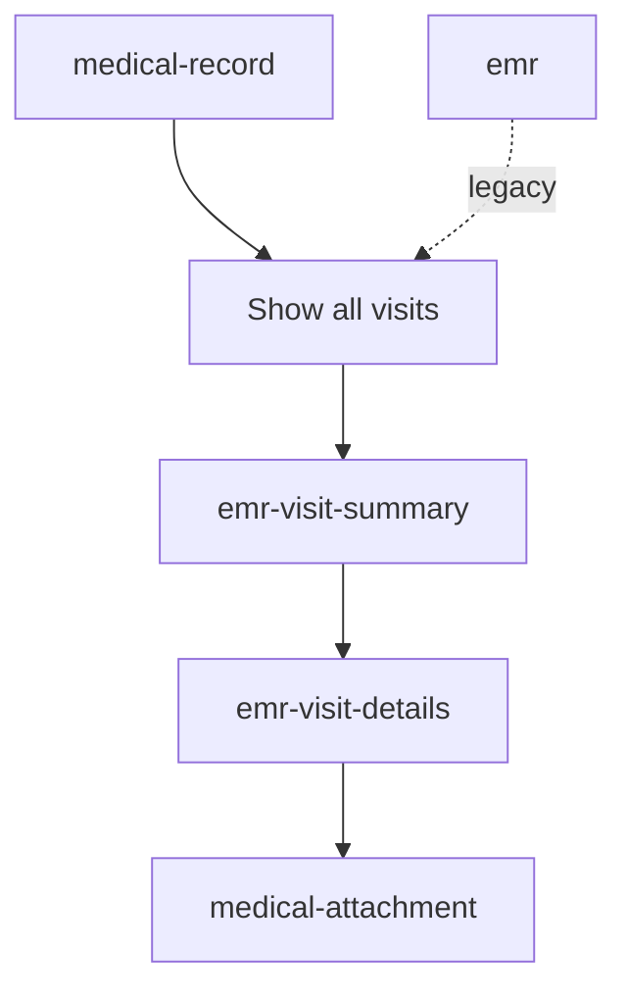

### Routes

| Route | Component | Purpose | Status |
|-------|-----------|---------|--------|
| `/home/medical-record` | visitsPage | List all medical visits | ✅ Active |
| `/home/emr-visit-summary` | VisitSummaryPage | Summary of a specific visit | ✅ Active |
| `/home/emr-visit-details` | visitDetailsPage | Detailed visit information | ✅ Active |
| `/home/medical-attachment` | MedicalAttachmentsPage | View/upload visit attachments | ✅ Active |
| `/home/emr` | EmrPage | Old EMR page (legacy route) | ⚠️ Legacy |

### Flow Description
1. **Medical Record** → Shows list of all visits for selected family member
2. **Visit Summary** → Overview of diagnosis, medications, etc.
3. **Visit Details** → Complete detailed view with lab results, prescriptions
4. **Attachments** → View/upload reports, scans, documents related to visit

### Modals/Popups
- **PDF Viewer**: For viewing medical documents inline

---

## Prescriptions

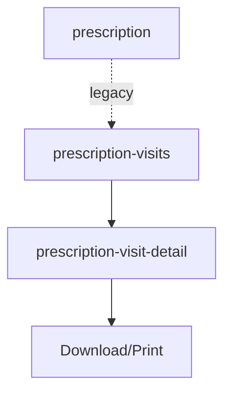

### Routes

| Route | Component | Purpose | Status |
|-------|-----------|---------|--------|
| `/home/prescription-visits` | PrescriptionVisitsPage | List all visits with prescriptions | ✅ Active |
| `/home/prescription-visit-detail` | PrescriptionVisitDetailPage | View detailed prescription for a visit | ✅ Active |
| `/home/prescription` | PrescriptionPage | Old prescription view | ⚠️ Legacy |

### Flow Description
1. **Prescription Visits** → Shows all visits that have prescriptions
2. **Visit Detail** → View complete prescription with medications, dosage, duration
3. **Actions**: Download PDF, print, view instructions

---

## Bills & Payments

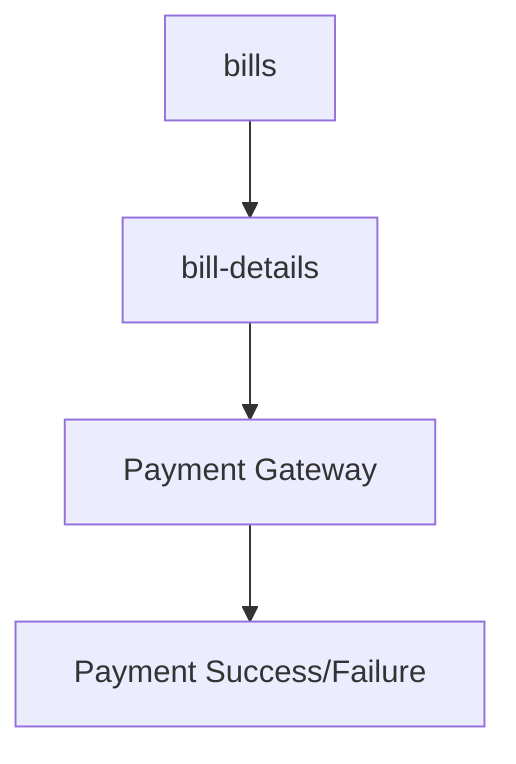

### Routes

| Route | Component | Purpose | Status |
|-------|-----------|---------|--------|
| `/home/bills` | BillsPage | View all bills (paid/pending/overdue) | ✅ Active |
| `/home/bill-details` | BillDetailsPage | Bill breakdown with payment options | ✅ Active |

### Flow Description
1. **Bills** → List view with filters (All/Paid/Pending/Overdue)
2. **Bill Details** → Itemized bill with payment button
3. **Payment** → Integrated with Razorpay/PayUMoney/BHIM/Google Pay
4. **Success** → Shows payment confirmation

### Features
- Multiple payment gateway support
- Bill status tracking
- Download bill receipts

---

## Family Management

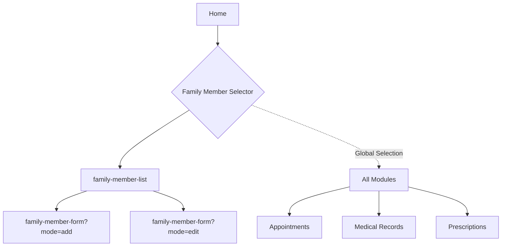

### Routes

| Route | Component | Purpose | Status |
|-------|-----------|---------|--------|
| `/home/family-member-list` | FamilyMemberListPage | View/manage family members | ✅ Active |
| `/home/family-member-form` | FamilyMemberFormPage | Add/edit family member | ✅ Active |
| `/home/profiles` | RecordsComponent | Alternative family list view | ✅ Active |

### Flow Description
1. **Global Selector** → Modal that appears when family member selection is required
2. **Family List** → Manage all family members (add/edit/delete)
3. **Add/Edit** → Form to add new or modify existing family member
4. **Selection Effect** → Changes data across all modules (appointments, EMR, prescriptions)

### Modals/Popups
- **Family Member Selector**: Modal component (not routed)

---

## Profile & Settings

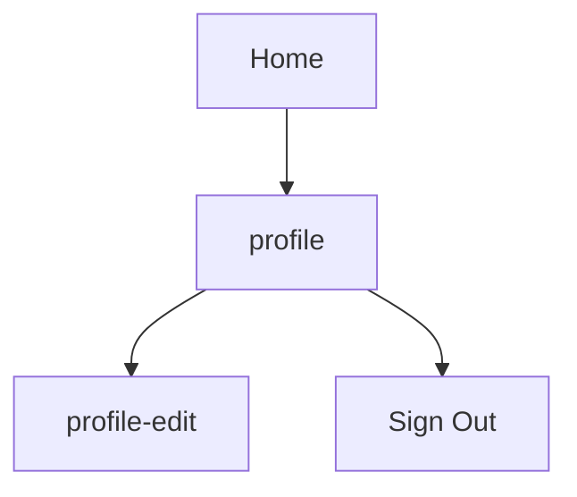

### Routes

| Route | Component | Purpose | Status |
|-------|-----------|---------|--------|
| `/home/profile` | ProfileOverviewPage | View user profile | ✅ Active |
| `/home/profile-edit` | ProfileEditionPage | Edit user information | ✅ Active |

### Flow Description
1. **Profile** → View user details, settings, app version
2. **Edit** → Modify user information, contact details
3. **Settings**: App version check, biometric auth, notifications
4. **Logout**: Sign out and return to login

---

## Documents & Attachments

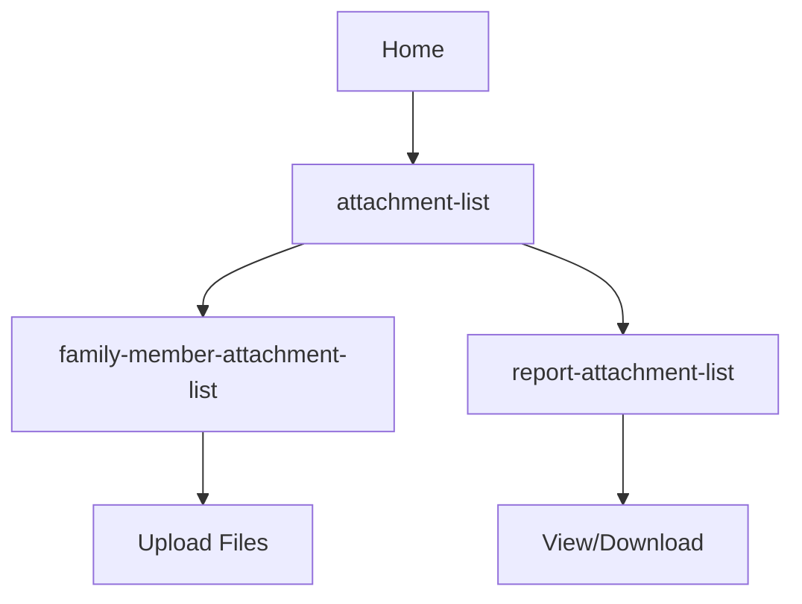

### Routes

| Route | Component | Purpose | Status |
|-------|-----------|---------|--------|
| `/home/attachment-list` | AttachmentListPage | View all uploaded documents | ✅ Active |
| `/home/family-member-attachment-list` | FamilyMemberAttachmentListPage | Upload/view documents for family member | ✅ Active |
| `/home/report-attachment-list` | ReportAttachmentListPage | View medical reports | ✅ Active |

### Flow Description
1. **Attachment List** → Main document repository
2. **Family Attachments** → Upload lab reports, prescriptions, scans for a family member
3. **Report List** → View/download specific medical reports

### Modals/Popups
- **Rename Attachment**: Modal for renaming documents
- **Confirmation Popup**: Confirm delete/actions

### Features
- **Drag & Drop**: Upload files from home dashboard
- **File Types**: PDF, images, scans
- **Categorization**: By family member, date, type

---

## Customer Service

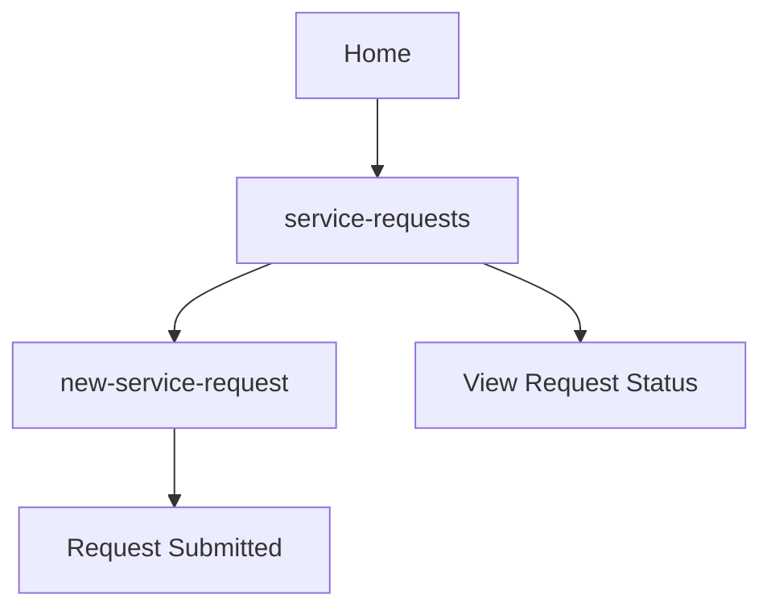

### Routes

| Route | Component | Purpose | Status |
|-------|-----------|---------|--------|
| `/home/service-requests` | ServiceRequestsPage | View all service requests | ✅ Active |
| `/home/new-service-request` | NewServiceRequestPage | Create new support request | ✅ Active |

### Flow Description
1. **Service Requests** → List of all support tickets
2. **New Request** → Submit new issue/query
3. **Track Status** → View request progress and responses

### Modals/Popups
- **Add Request Popup**: Quick add popup (not routed)

---

## Admin Features

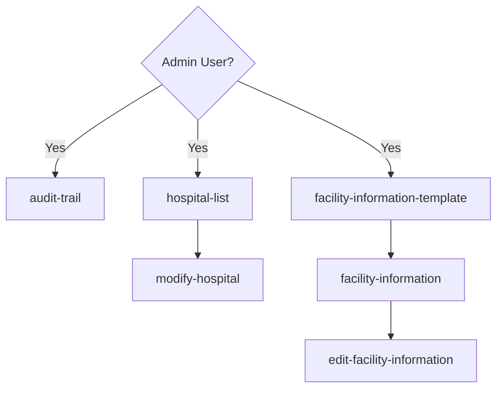

### Routes

| Route | Component | Purpose | Status | Access |
|-------|-----------|---------|--------|--------|
| `/home/audit-trail` | AuditTrailPage | System audit logs | ✅ Active | Admin only |
| `/home/hospital-list` | HospitalListPage | Manage hospitals | ✅ Active | Admin only |
| `/home/modify-hospital` | ModifyHospitalPage | Edit hospital details | ✅ Active | Admin only |
| `/home/facility-information-template` | FacilityInformationTemplatePage | Facility info template | ✅ Active | Admin only |
| `/home/facility-information` | FacilityInformationPage | View facility info | ✅ Active | Admin only |
| `/home/edit-facility-information` | EditFacilityInformationPage | Edit facility details | ✅ Active | Admin only |

### Flow Description
- **Admin-only Features**: Only visible to users with admin role
- **Audit Trail**: Track user actions, changes, system events
- **Hospital Management**: Add/edit/manage hospital data
- **Facility Management**: Manage facility information and settings

---

## Chat & Communication

### Routes

| Route | Component | Purpose | Status |
|-------|-----------|---------|--------|
| `/chat/:sessionId` | ChatPage | Video consultation chat | ✅ Active |
| `/home/chat-history` | ChatHistoryPage | Past chat conversations | ✅ Active |

### Flow Description
- **Chat**: Real-time chat during video consultations
- **History**: View past chat messages and conversations

---

## Unused/Legacy Pages

### Pages NOT in Routing Configuration

| Page | Last Known Purpose | Status | Notes |
|------|-------------------|--------|-------|
| `appointment-reschedule.page` | Reschedule appointments | ⚠️ Not Routed | Functionality likely moved to appointment-list |
| `appointment-modification.page` | Modify appointment details | ⚠️ Not Routed | Functionality likely moved to appointment-list |
| `user-information.page` | Admin: View user details | ⚠️ Not Routed | May be used as modal in audit-trail |
| `sidebar.page` | Navigation sidebar | ⚠️ Not Routed | Now using header-profile component |

### Pages with Legacy Routes

| Route | Replacement | Notes |
|-------|-------------|-------|
| `/home/emr` | `/home/medical-record` | Old EMR view, replaced with visits page |
| `/home/prescription` | `/home/prescription-visits` | Old prescription view, replaced with visits-based view |

### Recommendation
- **Keep**: These files may still be used programmatically or as modals
- **Review**: Check if functionality is duplicated in newer pages
- **Archive**: If confirmed unused, move to `/archive` folder or delete

---

## Modal/Popup Components (Not Routed)

These are used as overlays via `ModalController`, not as routed pages:

| Component | Used In | Purpose |
|-----------|---------|---------|
| `family-member-selector.component` | Global | Select active family member |
| `add-request-popup.page` | Customer Service | Quick add service request |
| `rename-attachment.page` | Attachments | Rename document |
| `confirmation-popup.page` | Various | Confirm delete/actions |
| `pdf-viewer-modal.component` | EMR, Attachments | View PDF documents |

---

## Navigation Patterns

### Primary Navigation
- **Bottom Tab Bar** (Home, Appointments, Profile, etc.) - via `footer-navigation.component`
- **Header Profile** - Access profile, logout - via `header-profile.component`

### Secondary Navigation
- **Back Button**: Handled globally by `BackButtonService`
- **Deep Links**: Support for `/sign-in/:hospitalCode`
- **State Passing**: Uses `NavigationExtras` with `state` for passing data

### Guard Protection
- **AuthGuardService**: Protects all routes except sign-in
- **Auto-redirect**: Unauthenticated users → sign-in
- **Session Management**: Stored in `StorageService`

---

## Data Flow Architecture

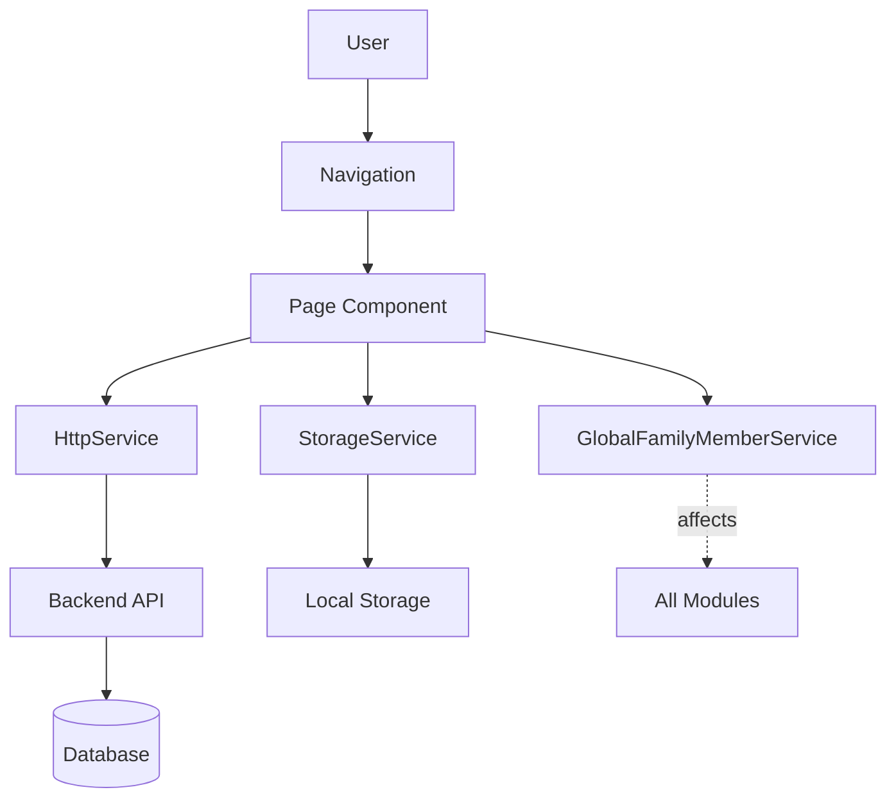

### Key Services
- **HttpService**: All API communication
- **StorageService**: Local data persistence
- **AuthenticationService**: Login, biometric auth
- **NavigationService**: Route management, back button
- **GlobalFamilyMemberService**: Family member selection affects entire app

---

## Platform Deployment

### Web
- **URL**: Standard Angular routing
- **Base Path**: `/`

### Android (Capacitor)
- **URL Scheme**: `medicsprime://`
- **Hash Routing**: Uses `#` for compatibility
- **Deep Links**: Supported for notifications

### iOS (Capacitor)
- **URL Scheme**: `medicsprime://`
- **Universal Links**: Can be configured
- **Safe-Area**: Now handled with iOS-safe utilities

---

## Route Access Summary

### Public Routes (No Auth Required)
- `/sign-in`
- `/sign-in/:hospitalCode`

### Protected Routes (Auth Required)
- `/home` and all child routes
- `/sign-up` (requires initial phone validation)
- `/token-verification`
- `/chat/:sessionId`
- `/patient-assessment`

### Admin Routes (Admin Role Required)
- `/home/audit-trail`
- `/home/hospital-list`
- `/home/modify-hospital`
- `/home/facility-information`
- `/home/facility-information-template`
- `/home/edit-facility-information`

---

## Testing Checklist

### Critical Paths to Test

**Authentication Flow**:
- [ ] Sign in with valid credentials
- [ ] Sign in with hospital code
- [ ] Sign up → OTP → Confirmation
- [ ] Invalid login handling
- [ ] Session expiration

**Home Dashboard**:
- [ ] View upcoming appointments
- [ ] Click "Book Appointment"
- [ ] Click "My Appointments"
- [ ] Click "Medical Records"
- [ ] Click "Prescriptions"
- [ ] Click "Bills"
- [ ] Family member selector

**Appointment Booking**:
- [ ] Full booking flow (Hospital → Doctor → Date/Time → Patient → Consent → Confirm)
- [ ] Join video consultation
- [ ] View appointment details

**Medical Records**:
- [ ] View visit list
- [ ] View visit summary
- [ ] View visit details
- [ ] Upload/view attachments

**Family Management**:
- [ ] Select family member
- [ ] Add new family member
- [ ] Edit family member
- [ ] Switch between family members
- [ ] Data updates across modules

---

## File Structure Reference

```
src/pages/
├── appointment/          # 10 pages
├── attachments/          # 5 pages (3 routed, 2 modals)
├── audit-trail-admin/    # 2 pages (1 routed, 1 modal)
├── chat/                 # 1 page
├── chat-history/         # 1 page
├── customer-service/     # 3 pages (2 routed, 1 modal)
├── edit-facility-information/ # 1 page
├── emr/                  # 3 pages
├── facility-information/ # 1 page
├── facility-information-template/ # 1 page
├── family-member/        # 2 pages
├── financials/           # 2 pages
├── home/                 # 3 pages (home, home-template, sidebar)
├── hospital-modification/ # 2 pages
├── login/                # 4 pages
├── patient-assessment/   # 1 page
├── prescription/         # 3 pages
├── reminder/             # 1 page
├── user/                 # 3 pages (profile-overview, profile-edition, profiles)
└── visit-records/        # 2 pages

Total: 51 page files
Active Routes: 36
Modals: 6
Legacy/Unused: 5-9 (needs verification)
```

---

## Conclusion

**Total Routes Analyzed**: 47
**Active & Functional**: 36
**Modals/Popups**: 6
**Legacy/Needs Review**: 5

**App Structure**: Well-organized with clear module separation. Most routes are actively used and part of the main user flow.

**Recommendations**:
1. Archive or remove confirmed unused pages
2. Consider migrating remaining legacy routes
3. Add automated route testing
4. Document admin-only routes more clearly
5. Consider lazy-loading optimization for less-used routes

---

**Document Status**: Complete
**Last Updated**: 2025-10-12
**Maintained By**: Development Team
